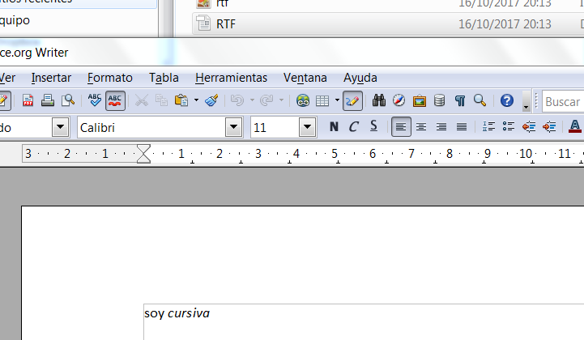

# LLSGI-01 IVELINA PETKOVA KOLEVA
**Descripción de la práctica**

+ **RTF (Formato de texto enriquecido, del inglés Rich Text Format)**
Tras crear el archivo con el Bloc de notas y cambiar la extensión a .rtf se genera el documento llamado RTF.rtf, probando su funcionamiento con la aplicación Wordpad con el siguiente resultado:

+ **XML (Xtensible Markup Language)**

Para mas informacion he usado la pagina web ->  [https://www.w3schools.com/xml/] 

+ **HTML (Lenguaje de marcas de hipertexto, del inglés HyperText Markup Language)** 
Utilizando el navegador internet explorer el resultado obtenido con el código redactado en el archivo html1.html es el que muestra la siguiente imagen:

 

